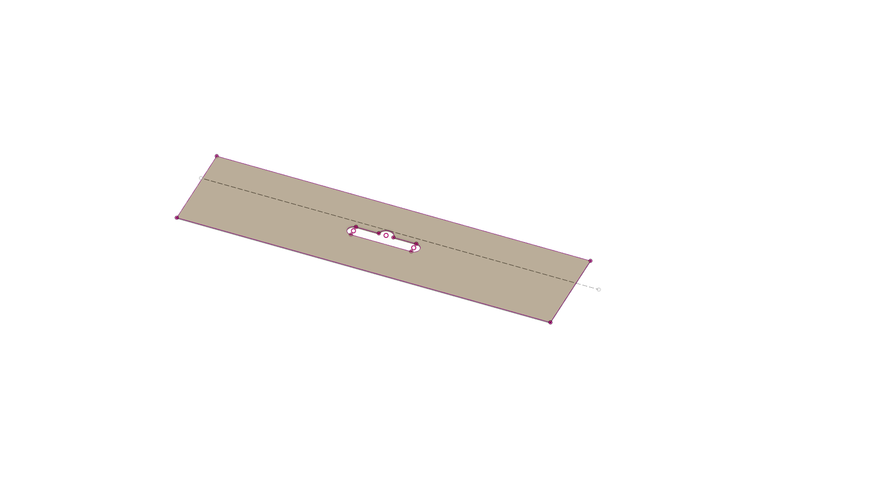
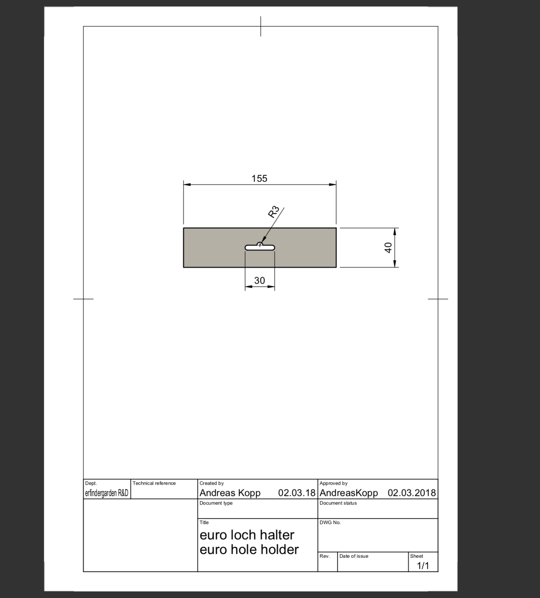

# Holder with euro loch
# holder with eurohole

I design a holder for the future erfindergarden prodcuts today so you can hang it on hooks with an euro hole. You 3D print this holder or lasercut out of cardboard or paper and then attach it with tacker to a plastic bag.

Here the online version [http://a360.co/2F6YGom](http://a360.co/2F6YGom)

## How you can help?

* also make more products in a fab lab
* start a etsy shop
* do workshops with kids on how to design a product
* design a euroloch perforator

## Contact

Andreas Kopp

[andreas@erfindergarden.de](mailto:andreas@erfindergarden.de)

## Credits
 
Thank you industry for the euro hole. 

## Licence

This project is [Public Domain (CC0 1.0 Universal (CC0 1.0)](https://creativecommons.org/publicdomain/zero/1.0/). Nobody cares what you do with this stuff.

For more information, see [license](license.md). 